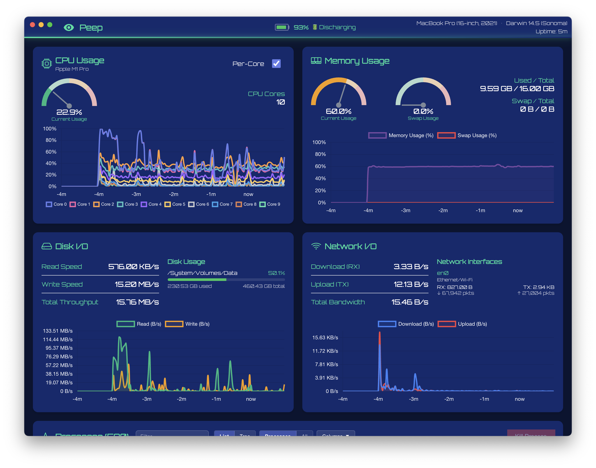
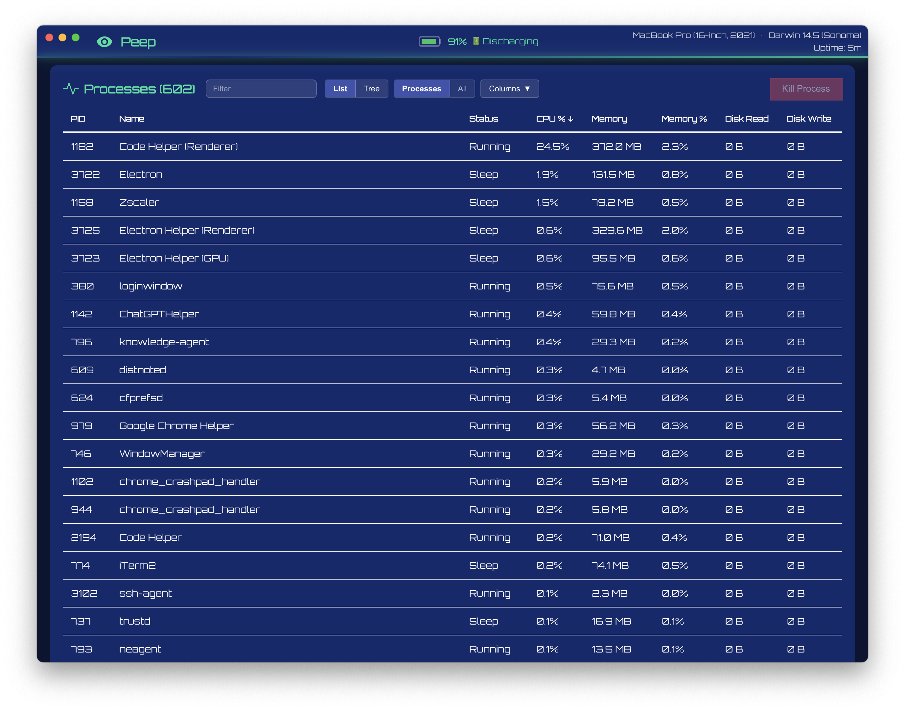

# Peep - System Monitor


System monitor application built with Electron and Rust. Monitor your system's performance in real-time.

## Features

- **Real-time CPU Monitoring** - View CPU usage and core count
- **Memory Tracking** - Monitor RAM usage with live updates
- **Disk I/O** - Track disk read/write throughput
- **Network I/O** - Monitor network upload/download speeds
- **Process Management** - View running processes with detailed information
- **Process Control** - Kill processes directly from the application
- **Native Performance** - Rust-powered native module for efficient system monitoring

## Screenshots





## Technology Stack

- **Frontend**: React + TypeScript
- **Desktop Framework**: Electron
- **Native Module**: Rust (via Neon)

## Prerequisites

Before building and running Peep, ensure you have the following installed:

- **Node.js** (v14 or higher)
- **npm** (comes with Node.js)
- **Rust** (latest stable version)
- **Cargo** (comes with Rust)

### Installing Prerequisites

#### macOS

```bash
# Install Node.js using Homebrew
brew install node

# Install Rust
brew install rust
```

## Installation

1. Clone the repository:
```bash
git clone https://github.com/glenthomas/peep.git
cd peep
```

2. Install dependencies:
```bash
npm install
```

## Development

### Running in Development Mode

```bash
# Build and run the application
npm start
```

### Building Individual Components

```bash
# Build only the native Rust module
npm run build:native

# Build only the main process
npm run build:main

# Build only the preload script
npm run build:preload

# Build only the renderer process
npm run build:renderer

# Build everything
npm run build
```

### Watch Mode for Frontend Development

```bash
npm run dev:renderer
```

Then in another terminal:
```bash
npm run build:main && npm run build:preload && electron .
```

## Building for Production

To create a distributable application:

```bash
npm run package
```

This will create a `.dmg` and `.zip` file in the `release` directory for macOS.

## Usage

Once the application is running:

1. **Dashboard View**: The main screen displays four cards showing:
   - CPU usage
   - Memory usage
   - Disk I/O
   - Network upload/download

2. **Process List**: Below the dashboard, you'll find a sortable table of running processes:
   - Click column headers to sort
   - Click the "Kill" button to terminate a process

3. **Real-time Updates**: All metrics update automatically every 2 seconds

## Project Structure

```
peep/
├── src/
│   ├── main/           # Electron main process
│   │   ├── main.ts     # Main entry point
│   │   └── preload.ts  # Preload script for IPC
│   └── renderer/       # React frontend
│       ├── components/ # React components
│       ├── App.tsx     # Main App component
│       ├── index.tsx   # React entry point
│       ├── index.html  # HTML template
│       └── styles.css  # Global styles
├── native/             # Rust native module
│   ├── src/
│   │   └── lib.rs      # Rust system monitoring code
│   └── Cargo.toml      # Rust dependencies
├── dist/               # Compiled output
├── webpack.config.js   # Webpack configuration
├── tsconfig.json       # TypeScript configuration
└── package.json        # Node.js dependencies and scripts
```

## Architecture

Peep uses a multi-layered architecture:

1. **Electron Main Process** (`src/main/main.ts`): 
   - Creates the application window
   - Handles IPC communication
   - Loads the native module

2. **Native Module** (`native/src/lib.rs`):
   - Written in Rust for performance
   - Uses the `sysinfo` crate for system information
   - Exposes functions to Node.js via Neon

3. **Renderer Process** (`src/renderer/`):
   - React-based UI
   - Communicates with main process via IPC
   - Updates UI in real-time

## Platform Support

Currently supported:
- ✅ macOS (Intel and Apple Silicon)

Planned support:
- ⏳ Linux
- ⏳ Windows

## Performance

The native Rust module ensures minimal overhead when collecting system information. The application typically uses:
- < 100MB RAM
- < 2% CPU (mostly from Electron)
- Updates every 2 seconds (configurable)

## Contributing

Contributions are welcome! Please feel free to submit a Pull Request.

## License

MIT License - See LICENSE file for details

---

Made with ⚡ by the Peep team
